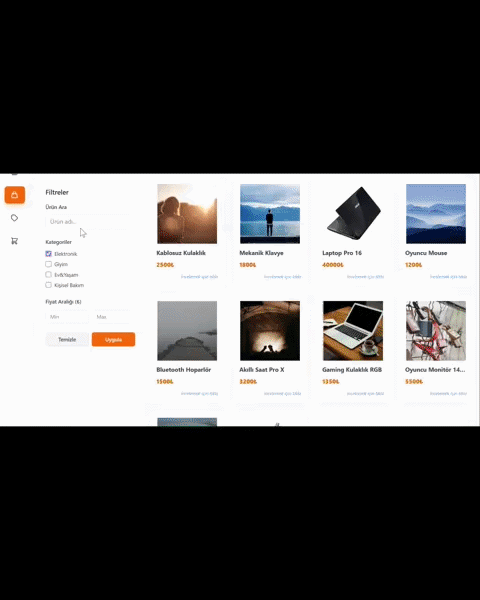

# 🛍️ MernShop

Modern ve responsive bir e-ticaret uygulaması. MERN stack ile geliştirilmiştir.



## 🚀 Özellikler

- 🔐 JWT tabanlı kimlik doğrulama (Register, Login, Logout)
- 📧 E-posta ile şifre sıfırlama (Nodemailer)
- 👤 Profil yönetimi (avatar, adres, il/ilçe seçimi)
- 🛒 Kullanıcıya özel sepet yönetimi
- 🔍 Ürün arama ve filtreleme (kategori, fiyat aralığı)
- 📦 Ürün detay sayfası ve benzer ürünler
- 🛠️ Admin paneli (ürün ekle, güncelle, sil)
- ☁️ Cloudinary ile resim yükleme
- 📱 Tam responsive tasarım (246px'e kadar)
- 🏷️ Kampanyalar sayfası

## 🧰 Kullanılan Teknolojiler

**Frontend:**
- React 19
- Redux Toolkit
- React Router DOM v7
- Tailwind CSS v4
- Axios
- React Toastify
- React Icons
- React Paginate
- SweetAlert2
- Turkey Neighbourhoods
**Backend:**
- Node.js
- Express.js
- MongoDB & Mongoose
- JWT (jsonwebtoken)
- Bcrypt.js
- Cloudinary
- Nodemailer
- Dotenv

## 📁 Kurulum

```bash
# Backend
cd server
npm install
npm run dev

# Frontend
cd client
npm install
npm run dev
```

## ⚙️ Ortam Değişkenleri

```env
MONGO_URI=
JWT_SECRET=
CLOUDINARY_NAME=
CLOUDINARY_API_KEY=
CLOUDINARY_API_SECRET=
EMAIL_USER=
EMAIL_PASS=
FRONTEND_URL=
```

## 👨‍💻 Geliştirici

**Hasan Erol**
[GitHub](https://github.com/HasanEROL1)
---
## 📫 Bana Ulaşın

[

